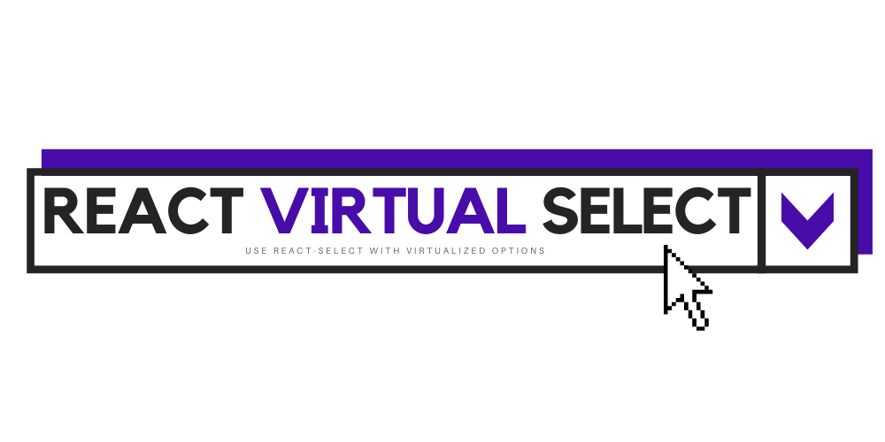

<div id="top"></div>

[![Contributors][contributors-shield]][contributors-url]
[![Forks][forks-shield]][forks-url]
[![Stargazers][stars-shield]][stars-url]
[![Issues][issues-shield]][issues-url]
[![MIT License][license-shield]][license-url]


<!-- PROJECT LOGO -->
<br />
<div align="center">
  <a href="https://github.com/lucbpz/react-virtual-select">
    
  </a>

<h3 align="center">REACT VIRTUAL SELECT</h3>

  <p align="center">
    Use <a href="https://react-select.com/home">React Select</a> with <a href="https://react-virtual.tanstack.com/">virtualized</a> options.
    <br />
    <a href="https://github.com/lucbpz/react-virtual-select"><strong>Explore the docs »</strong></a>
    <br />
    <br />
    <a href="https://github.com/lucbpz/react-virtual-select/issues">Report Bug</a>
    ·
    <a href="https://github.com/lucbpz/react-virtual-select/issues">Request Feature</a>
  </p>
</div>


<!-- TABLE OF CONTENTS -->
<details>
  <summary>Table of Contents</summary>
  <ol>
    <li>
      <a href="#about-the-project">About The Project</a>
      <ul>
        <li><a href="#built-with">Built With</a></li>
      </ul>
    </li>
    <li>
      <a href="#getting-started">Getting Started</a>
      <ul>
        <li><a href="#installation">Installation</a></li>
      </ul>
    </li>
    <li><a href="#usage">Usage</a></li>
    <li><a href="#roadmap">Roadmap</a></li>
    <li><a href="#contributing">Contributing</a></li>
    <li><a href="#license">License</a></li>
    <li><a href="#contact">Contact</a></li>
  </ol>
</details>


<!-- ABOUT THE PROJECT -->
## About The Project

[![Product Name Screen Shot][product-screenshot]](https://example.com)

This project was initially built as a side project, because we spent a some time tweaking React Select to work with our specific use cases, and we used React Virtualized in another part of an application we were working together in.

We saw there was another library, [React Virtual](https://react-virtual.tanstack.com/), that might be more updated than React Virtualized, and this was a use case we could try and learn how to use it as well.


### Built With

* [React-Select](https://react-select.com/home)
* [React-Virtual](https://react-virtual.tanstack.com/)


<p align="right">(<a href="#top">back to top</a>)</p>


<!-- GETTING STARTED -->
## Getting Started

This project has a monorepo structure and uses `yarn workspaces` to handle dependencies. To get a local copy up and running follow these steps.

### Installation

1. Clone the repo
   ```sh
   git clone https://github.com/lucbpz/react-virtual-select.git
   ```
2. Install NPM packages
   ```sh
   yarn install
   ```
3. Launch a demo app with React Virtual Select
   ```sh
   yarn dev
   ```
4. Launch documentation website locally
   ```sh
   cd docs && yarn dev
   ```

<p align="right">(<a href="#top">back to top</a>)</p>


<!-- USAGE EXAMPLES -->
## Usage

Use this space to show useful examples of how a project can be used. Additional screenshots, code examples and demos work well in this space. You may also link to more resources.

_For more examples, please refer to the [Documentation](https://example.com)_

<p align="right">(<a href="#top">back to top</a>)</p>


<!-- ROADMAP -->
## Roadmap

- [] Make React Virtual Select work!
- [] Export types
- [] Have nice docs
- [] Test with Cypress

See the [open issues](https://github.com/lucbpz/react-virtual-select/issues) for a full list of proposed features (and known issues).

<p align="right">(<a href="#top">back to top</a>)</p>


<!-- CONTRIBUTING -->
## Contributing

Contributions are what make the open source community such an amazing place to learn, inspire, and create. Any contributions you make are **greatly appreciated**.

If you have a suggestion that would make this better, please fork the repo and create a pull request. You can also simply open an issue with the tag "enhancement".
Don't forget to give the project a star! Thanks again!

1. Fork the Project
2. Create your Feature Branch (`git checkout -b feature/AmazingFeature`)
3. Commit your Changes (`git commit -m 'Add some AmazingFeature'`)
4. Push to the Branch (`git push origin feature/AmazingFeature`)
5. Open a Pull Request

Check out our [Contributing][contributing-url] file!

<p align="right">(<a href="#top">back to top</a>)</p>


<!-- LICENSE -->
## License

Distributed under the MIT License. See `LICENSE.txt` for more information.

<p align="right">(<a href="#top">back to top</a>)</p>


<!-- CONTACT -->
## Contact

Adrián Serrano - [@adrserr](https://twitter.com/adrserr)

Lucas Bernalte - [@lucasbernalte](https://twitter.com/lucasbernalte)

Project Link: [https://github.com/lucbpz/react-virtual-select](https://github.com/lucbpz/react-virtual-select)

<p align="right">(<a href="#top">back to top</a>)</p>


<!-- MARKDOWN LINKS & IMAGES -->
<!-- https://www.markdownguide.org/basic-syntax/#reference-style-links -->
[contributors-shield]: https://img.shields.io/github/contributors/lucbpz/react-virtual-select.svg?style=for-the-badge
[contributors-url]: https://github.com/lucbpz/react-virtual-select/graphs/contributors
[forks-shield]: https://img.shields.io/github/forks/lucbpz/react-virtual-select.svg?style=for-the-badge
[forks-url]: https://github.com/lucbpz/react-virtual-select/network/members
[stars-shield]: https://img.shields.io/github/stars/lucbpz/react-virtual-select.svg?style=for-the-badge
[stars-url]: https://github.com/lucbpz/react-virtual-select/stargazers
[issues-shield]: https://img.shields.io/github/issues/lucbpz/react-virtual-select.svg?style=for-the-badge
[issues-url]: https://github.com/lucbpz/react-virtual-select/issues
[license-shield]: https://img.shields.io/github/license/lucbpz/react-virtual-select.svg?style=for-the-badge
[license-url]: https://github.com/lucbpz/react-virtual-select/blob/master/LICENSE.txt
[contributing-url]: https://github.com/lucbpz/react-virtual-select/blob/master/CONTRIBUTING.md
[product-screenshot]: static/images/screenshot.png
[product-logo]: static/images/logo.png